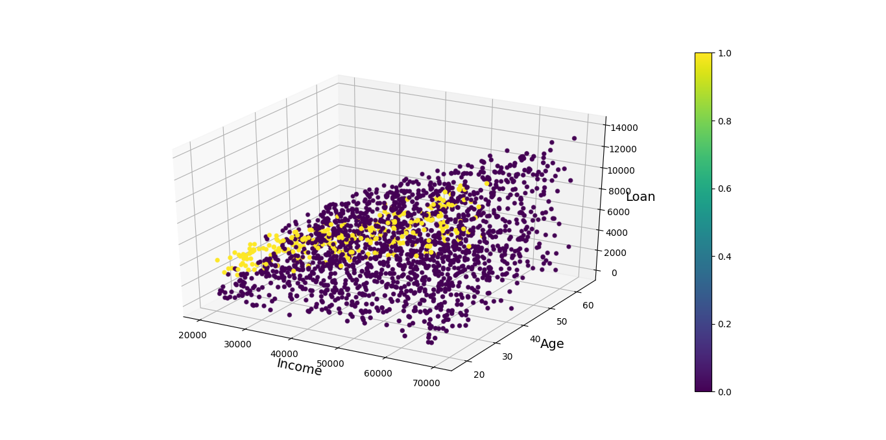
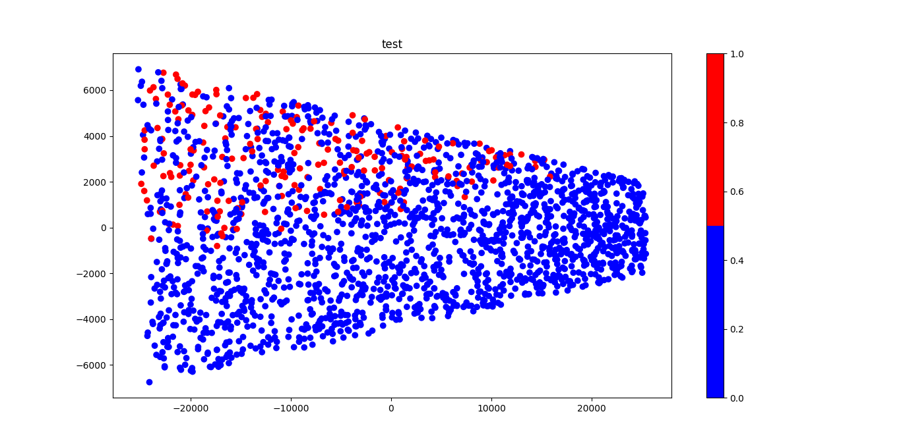
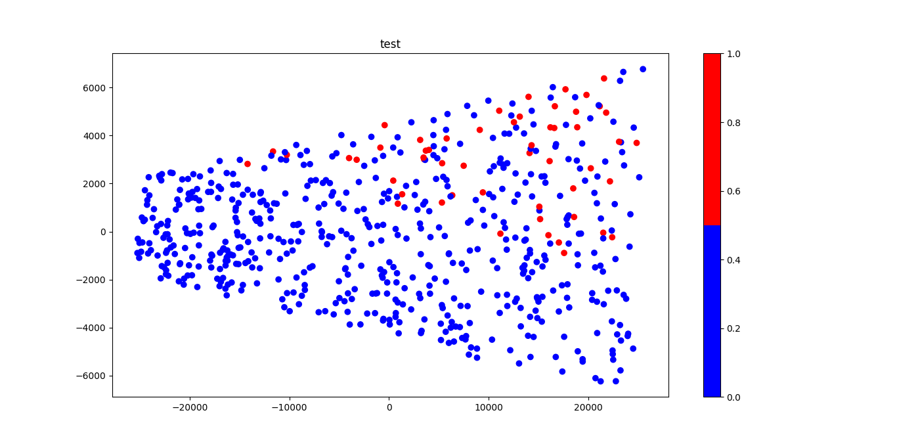
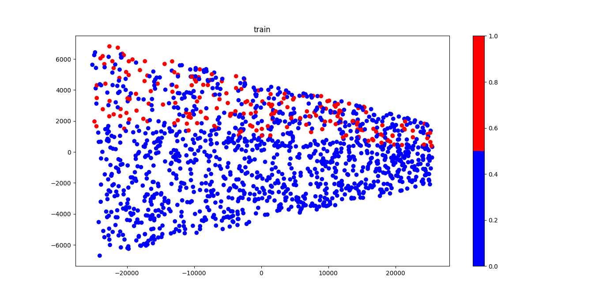
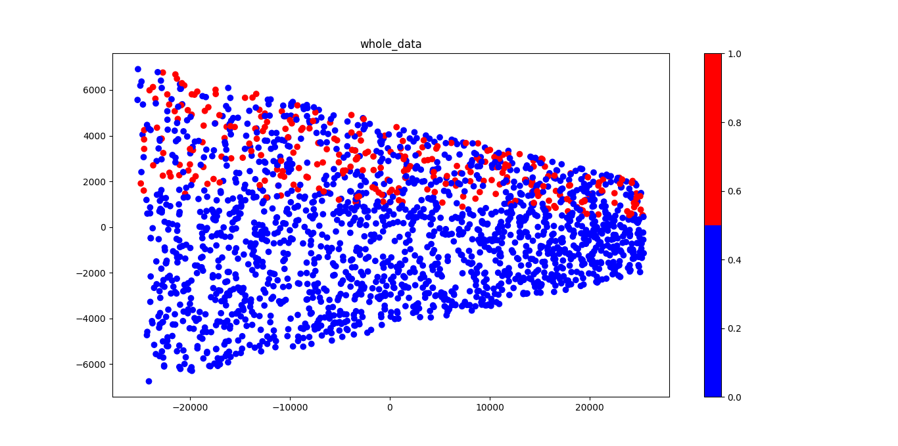
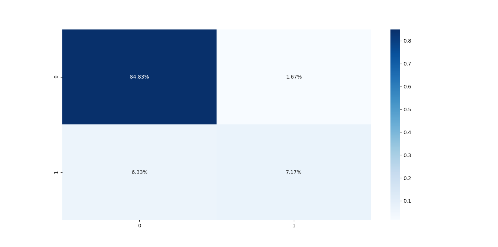

# Directory Structure
```text
.
├── api_test.py
├── app.py
├── data
│   └── credit_data.csv
├── docker-compose.yml
├── Dockerfile
├── figures
│   ├── Figure_cm_cv_.png
│   ├── Figure_cm_split_.png
│   ├── Figure_data.png
│   ├── Figure_pca_test_cv_.png
│   ├── Figure_pca_test_split_.png
│   ├── Figure_pca_train_split_.png
│   ├── Figure_pca_train+test_data_cv_.png
│   └── Figure_pca_whole_data_cv_.png
├── README.md
├── requirements.txt
├── run.py
├── utils
│   ├── data.py
│   ├── __init__.py
│   ├── model.py
│   └── plot.py
└── weights
    └── NaivBay-f4fs8.pkl

4 directories, 21 files
```

# Command Line Interface
```text
usage: run.py [-h] [--load LOAD] [--method {split,cv}]

optional arguments:
  -h, --help           show this help message and exit
  --load LOAD          True: Load trained model False: Train model default:
                       False
  --method {split,cv}  Training methods: cv- Cross-Validation default 10-Fold
                       split- default 70 perc train, 30 perc test
```

# Plot data
### Features: Income, Age, Loan
### Labels: Default or not



```text
Note: Data is very inbalance
```
## Plot Train & Test data with 2D PCA

### Test data to 2D PCA | Cross Validation method


### Test data to 2D PCA | Train Test Split method


### Train data to 2D PCA | Train Test Split method


### Train + Test data to 2D PCA


# Train the GaussianNB model

### Test Split method
```shell
python run.py --load no --method split
```
#### Confusion Matrix


#### Accuracy Score: 0.92

```text
Do you want to save the model weight? yes
Model saved at weights/NaivBay-f4fs8.pkl
```

### Cross-Validation method
```shell
python run.py --load no --method cv
```

#### Confusion Matrix


#### Accuracy Score: 0.927
```text
Do you want to save the model weight? yes
Model saved at weights/NaivBay-raowj.pkl
```

# Load the trained model
```shell
python run.py --load yes
```


# Docker for the GaussianNB model

## Build Docker image
You can build docker image by following:

```shell script
docker-compose build
```

## Run Docker container

You can launch a container from the Docker image by following:

```shell script
docker-compose up
```